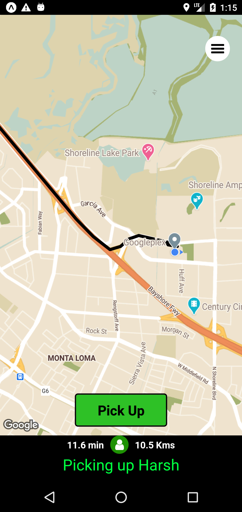

<h2>Here are pictures of working App.</h2>

1. Splash screen and login screen   
 &emsp;    

2. Login with google   
 &emsp;    

3. Drawer menu and Home Screen and Edit profile  
 &emsp;  &emsp;    

4. Selecting and Picking up rider   
 &nbsp;    

5. Dropping rider and finishing ride   
 &emsp;    
